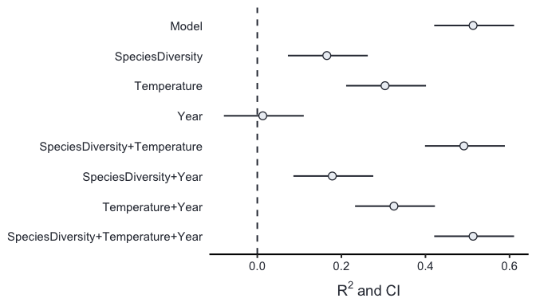

[](https://www.tidyverse.org/lifecycle/#maturing)
<!-- README.md is generated from README.Rmd. Please edit that file -->

# partR2

The goal of partR2 is to estimate R<sup>2</sup> in GLMMs (sensu Nakagawa
& Schielzeth 2013) and to partition the R<sup>2</sup> into the variance
explained by the predictors.

The package takes a fitted lme4 model as input and gives you:

  - R<sup>2</sup> (marginal or conditional)
  - Semi-partial R<sup>2</sup>, the variance explained uniquely by each
    predictor and combinations of predictors
  - Inclusive R<sup>2</sup>, the variance explained by a predictor
    independent of all other predictors
  - Structure coefficients, the correlation between a predictor and the
    fitted response
  - Beta weights, standardised model estimates

All estimates can be combined with parametric bootstrapping to get
confidence intervals.

partR2 is in an early phase of development and despite a lot of testing
might still contain bugs, so be careful and thoughtful when using it.

## Installation

You can install partR2 from github with:

``` r
# install.packages("remotes")
remotes::install_github("mastoffel/partR2", build_vignettes = TRUE, dependencies = TRUE) 
# check vignette
browseVignettes("partR2")
```

## Example

``` r
library(partR2)
library(lme4)

?`partR2-package`

# load data
data(biomass)
# fit lme4 model
mod <- lmer(Biomass ~  Year + Temperature + SpeciesDiversity + (1|Population),
            data = biomass)
# R2s and partial R2s
(R2 <- partR2(mod,  partvars = c("SpeciesDiversity", "Temperature", "Year"),
                                 R2_type = "marginal", nboot = 100, CI = 0.95,
                                 data = biomass))
#> 
#> 
#> R2 (marginal) and 95% CI for the full model: 
#>  R2     CI_lower CI_upper nboot ndf
#>  0.5133 0.4208   0.6108   100   4  
#> 
#> ----------
#> 
#> Part (semi-partial) R2:
#>  Predictor(s)                      R2     CI_lower CI_upper nboot ndf
#>  Model                             0.5133  0.4208  0.6108   100   4  
#>  SpeciesDiversity                  0.1653  0.0728  0.2628   100   3  
#>  Temperature                       0.3038  0.2113  0.4013   100   3  
#>  Year                              0.0130 -0.0795  0.1105   100   3  
#>  SpeciesDiversity+Temperature      0.4914  0.3989  0.5889   100   2  
#>  SpeciesDiversity+Year             0.1784  0.0859  0.2758   100   2  
#>  Temperature+Year                  0.3250  0.2325  0.4225   100   2  
#>  SpeciesDiversity+Temperature+Year 0.5133  0.4208  0.6108   100   1
```

And to plot the
results:

``` r
forestplot(R2, type = "R2", line_size = 0.7, text_size = 14, point_size = 3)
```

<!-- -->
